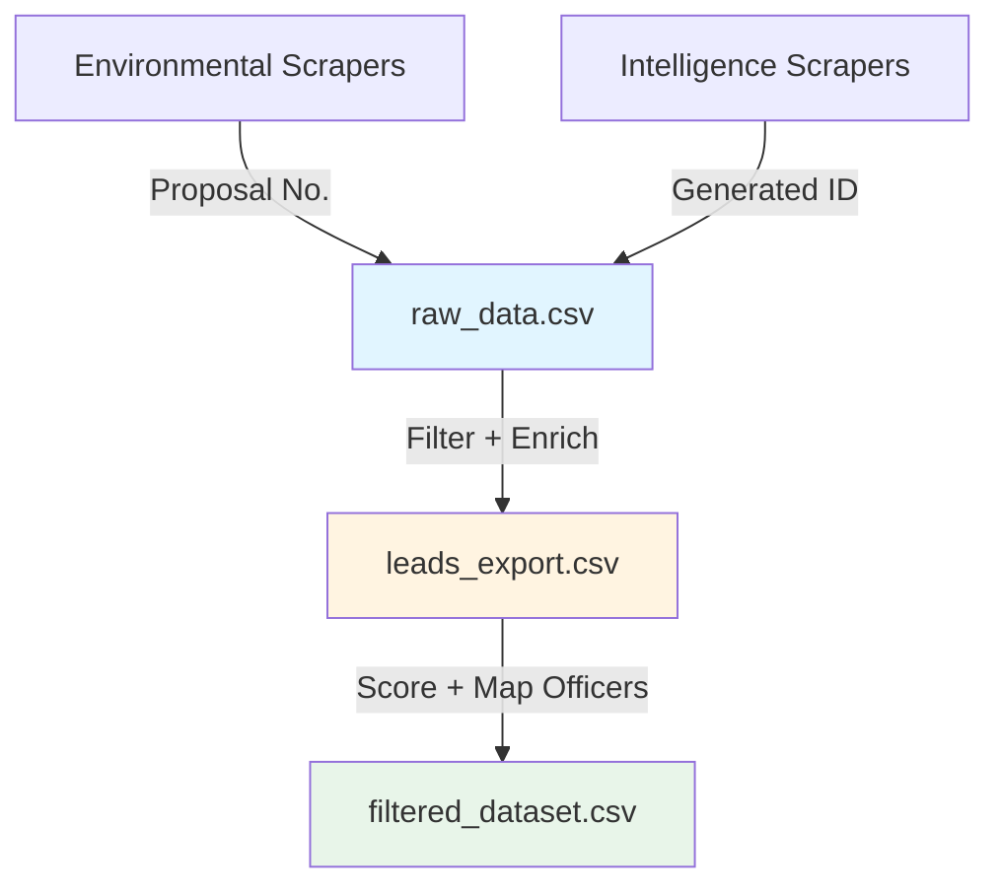

# Two-Step Data Processing Pipeline Architecture

## Overview

The system now uses a robust two-step pipeline architecture to ensure data consistency, meaningful IDs, and rich metadata integration.

### Pipeline Flow



### Components

#### 1. Raw Data Aggregator (`aggregate_raw_data.py`)
- **Input**: Scraped CSVs from `data/scraped_data/` and existing intelligence.
- **Output**: `data/raw_data.csv`
- **Function**: Unifies diverse data sources into a single schema.
- **ID Strategy**: 
  - Environmental: Preserves `Proposal No.`
  - Intelligence: Generates `INT-{SOURCE}-{SEQ}`

#### 2. Lead Processor (`process_leads.py`)
- **Input**: `data/raw_data.csv`
- **Output**: `data/leads_export.csv`
- **Function**: 
  - Applies business logic filters
  - Classifies **Signal Type** (e.g., "Environmental Clearance", "Expansion", "Tender")
  - Extracts keywords
  - Infers product matches

#### 3. Scoring & Officer Mapping (`filter_leads.py` + `map_officers_to_leads.py`)
- **Input**: `data/leads_export.csv`
- **Output**: `data/filtered_dataset.csv`
- **Function**:
  - Calculates lead scores
  - Assigns Priority Tier
  - Maps nearest HPCL officer

### Data Files

| File | Purpose | Key Columns |
|------|---------|-------------|
| `raw_data.csv` | Unified raw dump | `id`, `source_system`, `raw_json` |
| `leads_export.csv` | enriched intermediate | `id`, `signal_type`, `keywords` |
| `filtered_dataset.csv` | Agent-ready final | `ID`, `Officer_Name`, `Final_Score` |

### Execution

Run the complete pipeline with a single command:

```bash
python run_full_pipeline.py
```
